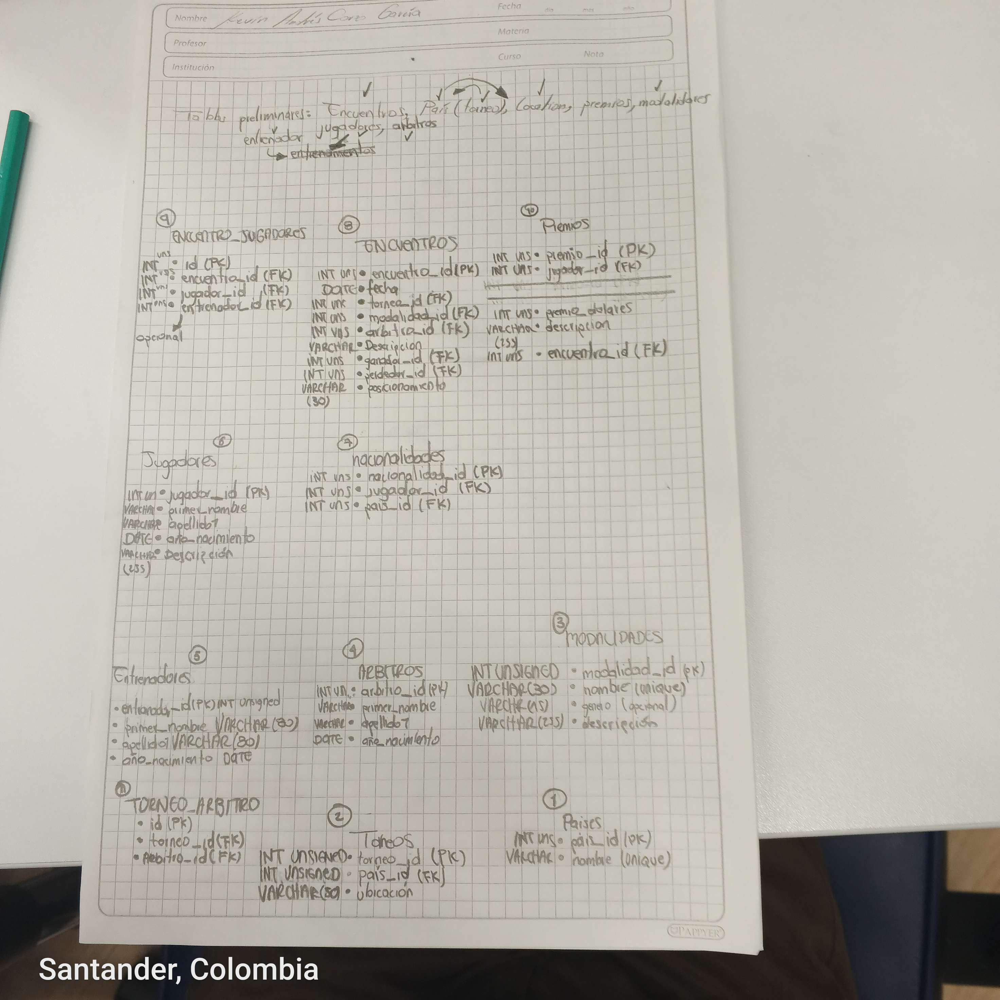

# Identificacion de entidades y atributos

**Especificaciones:** El sistema debe almacenar de manera integral la información de todos los encuentros que han tenido lugar desde el inicio del torneo, incluyendo diversas características asociadas. En el contexto del Grand Slam, que consta de cuatro torneos anuales celebrados en Gran Bretaña, Estados Unidos, Francia y Australia, es importante considerar que cada país puede albergar el torneo en diferentes ubicaciones, como Forest Hill o Flashing Meadows en EE. UU.

Cada partido está vinculado a un premio de consolación para el perdedor, cuyo monto depende de la fase del torneo en la que se encuentre (por ejemplo, el perdedor de octavos de final puede recibir 5,000 dólares). El ganador de la final, por su parte, obtendrá el premio correspondiente al torneo. Además, se deben contemplar cinco modalidades de juego en cada torneo: Individual masculino, individual femenino, dobles masculino, dobles femenino y dobles mixtos.

Es esencial tener en cuenta la nacionalidad de los jugadores, ya que estos pueden ser apátridas o tener múltiples nacionalidades.
Imagen o texto

Ejemplo del texto:

1. **Entidad**

- atributo (PK)
- atributo (varchar 255)
- atributo (...)
- atributo (FK)
- atributo (UC)


# Imagen "Modelo Fisico"




# Consultas


1. Dado un año y un torneo, composición y resultado de los partidos.

    ```sql
      DELIMITER //
      CREATE PROCEDURE Consulta1(IN anio VARCHAR(4),
                                    torneo INT UNSIGNED)
      BEGIN 
      SELECT  
      (SELECT j.jugador_id as id_ganador,CONCAT(j.primer_nombre, ' ', j.primer_apellido) AS jugador
      FROM encuentros e
      INNER JOIN jugadores j ON j.jugador_id = e.ganador_id) AS Ganador,
      (SELECT j.jugador_id as id_perdedor,CONCAT(j.primer_nombre, ' ', j.primer_apellido) AS jugador
      FROM encuentros e
      INNER JOIN jugadores j ON j.jugador_id = e.perdedor_id) AS Perdedor
      FROM torneos t
      JOIN  encuentros e ON t.torneo_id = e.torneo_id
      WHERE YEAR(t.anio) = 1992 AND t.torneo_id = 10;
      END //
      DELIMITER ; 

    ```

2. Lista de árbitros que participaron en el torneo. (Por falta de datos, no todos los torneos funcionan, tendrìa que hacerse inserciòn de absolutamente todos los torneos, encuentros y despuès arbitros, claramente hay algunos pero no todos siguen la ruta)

    ```sql
      DELIMITER //
      CREATE PROCEDURE Consulta2(IN torneo INT UNSIGNED)
      BEGIN 
      SELECT t.torneo_id,e.encuentro_id, a.arbitro_id,a.primer_nombre, p.nombre, t.ubicacion
      FROM encuentros e
      JOIN arbitros a ON e.arbitro_id = a.arbitro_id
      JOIN torneos t ON e.torneo_id = t.torneo_id
      JOIN paises p ON t.pais_id = p.pais_id
      WHERE t.torneo_id = torneo;
      END //
      DELIMITER ; 
      
      CALL Consulta2(10);
      CALL Consulta2(9);
      CALL Consulta2(4);
      CALL Consulta2(3);
      
    ```

3. Ganancias percibidas en premios por un jugador a lo largo del torneo.(Para buscar mas datos, hacer seguimiento de los datos 'Premios')

    ```sql
      DELIMITER //
      CREATE PROCEDURE Consulta3(IN jugadorId INT UNSIGNED,
                                    torneoId INT UNSIGNED)
      BEGIN
       
      SELECT j.jugador_id as ID,j.primer_apellido AS Jugador, SUM(precio_dolares) as `GANANCIAS TOTALES`
      FROM premios p
      RIGHT JOIN jugadores j ON p.jugador_id = j.jugador_id
      JOIN encuentros e ON p.encuentro_id = e.encuentro_id
      WHERE j.jugador_id = jugadorId AND e.torneo_id = torneoId
      GROUP BY j.jugador_id;
      
       END //
      DELIMITER ; 
      CALL Consulta3(3,10);
      CALL Consulta3(2,5);
      CALL Consulta3(1,5);

    ```

4. Lista de entrenadores que han entrenado a un jugador a lo largo del torneo y fechas en las que lo hizo.

    ```sql
      SELECT *
      FROM ENCUENTROS 
    ```

5. Connors gano Gerulaitis en Roland Garros en 1979 en cuartos de final en individuales masculinos por 6-3 4-6/7-5 6-0.

    ```sql
      # Consulta Aqui
    ```

6. El señor Wilkinson arbitro ese partido.

    ```sql
      select a.primer_nombre AS ARBITRO, e.*
      from encuentros e
      JOIN arbitros a ON e.arbitro_id = a.arbitro_id
      where e.arbitro_id = 1 OR a.primer_nombre = 'Wilkinson';
    ```

7. Alemania ha ganado dos veces las individuales masculinas de Wimbledon. Borg ha ganado 2.000.000 de dólares a lo largo de su participación en el Grand Slam.
(La consulta si bota el resultado, pero inserte datos de màs  )

    ```sql
      SELECT e.*, j.*, p.nombre
      FROM encuentro_jugadores ej
      JOIN encuentros e ON ej.encuentro_id = e.encuentro_id
      JOIN jugadores j ON ej.jugador_id = j.jugador_id
      JOIN nacionalidades n ON j.jugador_id = n.jugador_id
      JOIN paises p ON n.pais_id = p.pais_id
      WHERE p.nombre = 'Alemania' AND e.posicionamiento = 'Final'
      AND e.modalidad_id = 1 AND (e.torneo_id = 9 or e.torneo_id = 10);

    ```

8. El ganador de Roland Garros de 1987 ganó 20.000 dólares.

    ```sql
      select j.jugador_id, j.primer_apellido,p.descripcion, e.resultados, p.precio_dolares
      from encuentros e
      JOIN jugadores j ON e.ganador_id = j.jugador_id
      JOIN premios p ON p.encuentro_id = e.encuentro_id
      WHERE e.posicionamiento = 'Final' AND YEAR(e.fecha) = 1987; 
      
    ```

9. Noah ha jugado cuatro veces en dobles mixtos con Mandlikova.

    ```sql
      # Consulta Aqui
    ```